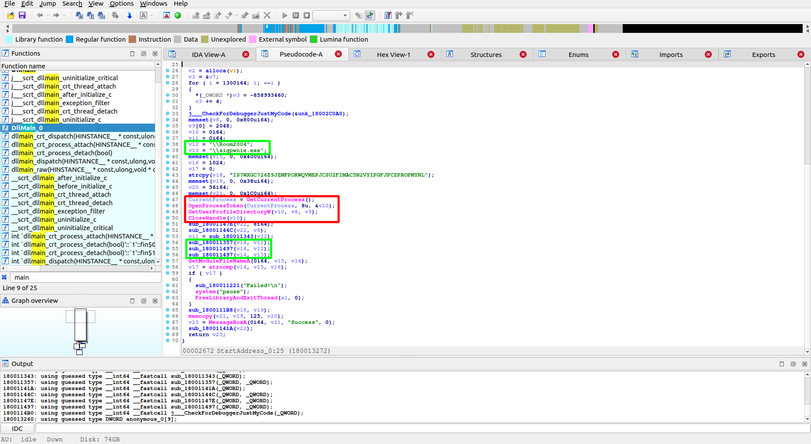
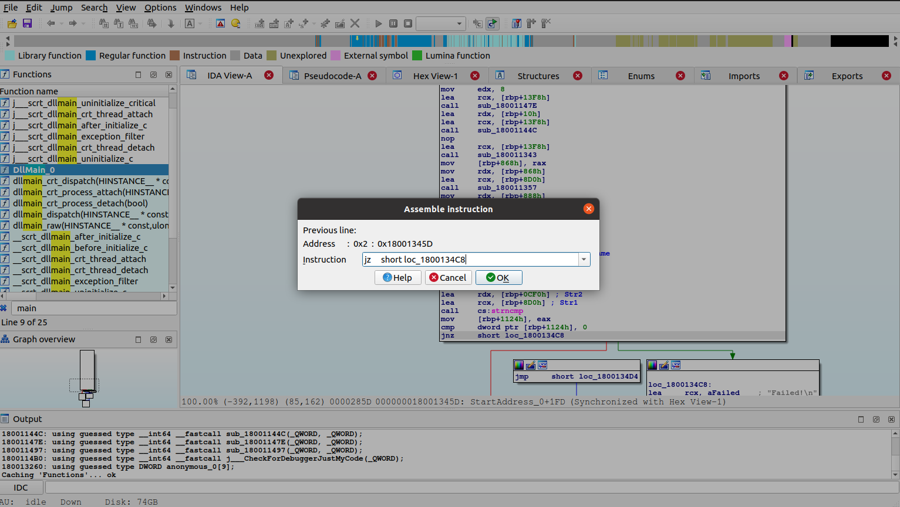

# SOLUTION for Reject to Inject 

If you first open the given dll in IDA, you'll find the main function of this dll.



As you can see, it is first getting the user profile address. Then, after some additional operation (which is mostly just type conversion), it appends the strings listed above(`\\Room2004` & `\\sigpwnie.exe`). At last, it compares the final string with what is received from GetModuleFileNameA, the dll location in one's computer.

If they are the same, the dll will print the flag after decoding some random string that has been written.

Therefore, based on what we found, we now know that we should write a simple .exe program that would link the given dll, name it `sigpwnie.exe`, and place it at `%USERPROFILE%\Room2004`. (`%USERPROFILE%` is usually located at `C:\Users\{your username}` in Windows.)

There are several different ways to load a dll in an executable, but all of them should include [LoadLibrary()](https://docs.microsoft.com/en-us/windows/win32/api/libloaderapi/nf-libloaderapi-loadlibrarya) WINAPI function to do so unless you are using some sort of DLL Injector.

My simple solution executable

```
#include <Windows.h>
#include <stdio.h>


int main() {
    HANDLE hdll = LoadLibrary("IV.dll");
    system("pause");
}
```
### [TLDR] After building an executable that calls LoadLibrary() in the same x64 architecture as that of dll, naming it `sigpwnie.exe` and placing both the .exe and IV.dll in `%USERPROFILE%\Room2004`, one can run the program to obtain the flag. 

Alternatives:
- Simply patch the dll by reversing `jnz` located right after the `strcmp` to `jz`, write an .exe that simply loads the patched dll with any name and location, then run it
  


That's all! I believe the chal itself was not difficult but might have caught some off guard who were not familiar with WINAPIs and dlls. To all who have tried solving this, well done and I hope you had fun:)
